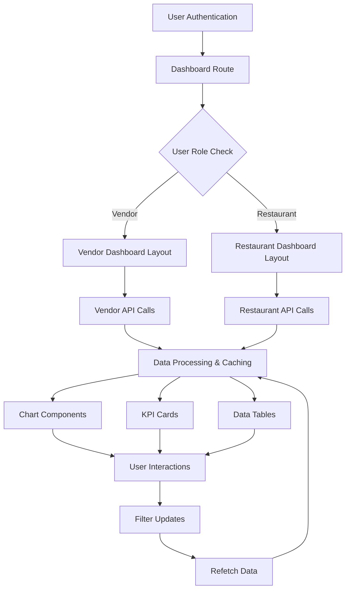

# 📊 Aaroth Fresh B2B Marketplace - Advanced Dashboard Implementation Guide

## 🎯 Project Overview

You are implementing **comprehensive vendor and restaurant dashboards** for Aaroth Fresh, a B2B marketplace connecting local vegetable vendors with restaurants in Bangladesh. The backend provides 26+ advanced dashboard endpoints with real-time analytics, notifications, and business intelligence features.

## 🏗️ Architecture Context

### Backend Structure
- **API Base**: `/api/v1`
- **Authentication**: JWT Bearer tokens with phone-based auth
- **Vendor Dashboard**: `/vendor-dashboard/*` (12 endpoints)
- **Restaurant Dashboard**: `/restaurant-dashboard/*` (14 endpoints)
- **Real-time Features**: Notifications, inventory alerts, budget warnings
- **Performance**: 40+ database indexes, optimized aggregation queries

### User Roles & Access
```javascript
const USER_ROLES = {
  VENDOR: 'vendor',                    // Sells products, manages inventory
  RESTAURANT_OWNER: 'restaurantOwner', // Makes purchasing decisions
  RESTAURANT_MANAGER: 'restaurantManager', // Places orders, limited access
  ADMIN: 'admin'                       // Platform management
};
```

## 🚀 Implementation Requirements

### 1. **Dashboard Layout System**

#### Create Role-Based Dashboard Layouts
```typescript
// Required Components:
- DashboardLayout.tsx         // Main container with sidebar + header
- VendorSidebar.tsx          // Vendor navigation menu
- RestaurantSidebar.tsx      // Restaurant navigation menu
- DashboardHeader.tsx        // Header with notifications + user info
- ProtectedRoute.tsx         // Role-based route protection

// Navigation Structure:
// Vendor Dashboard:
// - Overview (KPIs, trends, recent activity)
// - Revenue Analytics (charts, growth, payments)
// - Product Performance (top products, categories)
// - Order Management (pending, processing, history)
// - Inventory Status (stock levels, alerts)
// - Customer Insights (loyalty, acquisition)
// - Financial Reports (P&L, commission tracking)
// - Notifications (real-time alerts)

// Restaurant Dashboard:
// - Overview (spending, budget status, orders)
// - Spending Analytics (trends, vendor breakdown)
// - Vendor Insights (performance, reliability scores)
// - Budget Tracking (limits, alerts, recommendations)
// - Order History (filtering, search, status)
// - Inventory Planning (consumption, reorder suggestions)
// - Favorite Vendors (frequently used, quick reorder)
// - Notifications (budget alerts, order updates)
```

#### Responsive Design Requirements
- **Mobile-first approach** with breakpoints at 768px, 1024px, 1280px
- **Collapsible sidebar** on mobile devices
- **Touch-friendly interactions** for mobile/tablet users
- **Progressive enhancement** for desktop features

### 2. **State Management & API Integration**

#### RTK Query Setup
```typescript
// Required API Slices:
- store/api/dashboardSlice.ts    // All dashboard endpoints
- store/api/notificationSlice.ts // Notification management
- store/slices/dashboardSlice.ts // UI state (filters, preferences)

// Key Features:
- Real-time polling for live data updates
- Optimistic updates for better UX
- Error handling with retry logic
- Background refetching on window focus
- Cached data with smart invalidation
```

#### Data Fetching Patterns
```typescript
// Implementation Examples:

// 1. Dashboard Overview with Auto-refresh
const { data, isLoading, error } = useGetVendorDashboardOverviewQuery(
  { period: 'month' },
  { 
    pollingInterval: 300000, // 5-minute refresh
    refetchOnFocus: true,
    refetchOnReconnect: true 
  }
);

// 2. Filtered Data with Debounced Queries
const [filters, setFilters] = useState({ category: '', dateRange: 'month' });
const debouncedFilters = useDebounce(filters, 300);
const { data: products } = useGetVendorProductPerformanceQuery(debouncedFilters);

// 3. Paginated Lists with Infinite Scroll
const { data, fetchNextPage, hasNextPage } = useInfiniteQuery({
  queryKey: ['orders', filters],
  queryFn: ({ pageParam = 1 }) => fetchOrders({ ...filters, page: pageParam }),
  getNextPageParam: (lastPage) => lastPage.nextPage
});
```

### 3. **Advanced Analytics & Visualization**

#### Chart Library Integration
**Use Chart.js with react-chartjs-2** for consistent, performant visualizations:

```typescript
// Required Chart Types:
- Line Charts: Revenue trends, order volume, budget tracking
- Bar Charts: Category performance, vendor comparison
- Doughnut Charts: Order status distribution, budget allocation  
- Area Charts: Seasonal trends, cumulative spending
- Mixed Charts: Revenue vs orders (dual axis)

// Performance Requirements:
- Memoized chart components to prevent unnecessary re-renders
- Data aggregation on frontend for large datasets
- Loading skeletons for chart components
- Responsive chart sizing for mobile devices
```

#### KPI Cards & Metrics
```typescript
// Implementation Pattern:
interface KPICardProps {
  title: string;
  value: number | string;
  change?: number;        // Growth percentage
  format?: 'currency' | 'number' | 'percentage';
  trend?: 'up' | 'down' | 'neutral';
  loading?: boolean;
  onClick?: () => void;   // Navigation to detailed view
}

// Required Metrics:
// Vendor KPIs: Revenue, Orders, AOV, Customer Retention, Inventory Turnover
// Restaurant KPIs: Total Spent, Budget Used, Vendor Count, Order Frequency
```

### 4. **Real-time Notification System**

#### Notification Features
```typescript
// Notification Types:
- Inventory Alerts: Low stock, out of stock warnings
- Order Updates: New orders, status changes, delivery confirmations  
- Budget Warnings: Spending limits exceeded, category overspending
- System Notifications: Feature updates, maintenance alerts

// Implementation Requirements:
- Toast notifications for urgent alerts
- Notification center dropdown with action buttons
- Real-time badge counts on navigation
- Mark as read functionality
- Action buttons that link to relevant dashboard sections
- Priority-based styling (urgent=red, high=orange, medium=blue, low=gray)
```

#### Notification Context
```typescript
// Required Context Features:
interface NotificationContextType {
  notifications: Notification[];
  unreadCount: number;
  markAsRead: (ids: string[]) => Promise<void>;
  markAllAsRead: () => Promise<void>;
  subscribeToNotifications: () => void;
  unsubscribeFromNotifications: () => void;
}

// Auto-polling every 60 seconds for new notifications
// Toast integration for urgent notifications (priority: 'urgent')
// Optimistic updates for mark-as-read actions
```

### 5. **Advanced Data Filtering & Search**

#### Filter System
```typescript
// Required Filter Components:
- DateRangePicker: Custom periods, preset ranges (today, week, month, quarter, year)
- CategoryFilter: Multi-select product categories
- VendorFilter: Search and select vendors
- StatusFilter: Order/listing status filtering
- PriceRangeFilter: Min/max price inputs
- SortingControls: Sort by various metrics

// Filter Persistence:
- Save filter preferences in localStorage
- URL state management for shareable filtered views
- Reset to defaults functionality
```

#### Search Implementation
```typescript
// Search Features:
- Global search across products, vendors, orders
- Autocomplete with debounced queries
- Search history and suggestions
- Advanced search with multiple criteria
- Search result highlighting
```

### 6. **Data Export & Reporting**

#### Export Functionality
```typescript
// Required Export Features:
- CSV/Excel export for all data tables
- PDF reports for financial summaries
- Chart image exports (PNG/SVG)
- Date range selection for exports
- Custom column selection for tables
- Email reports functionality

// Implementation:
- Use libraries like react-csv, jspdf, html2canvas
- Progress indicators for large exports
- Error handling for failed exports
```

### 7. **Performance Optimization Strategies**

#### Code Splitting & Lazy Loading
```typescript
// Route-based splitting:
const VendorDashboard = lazy(() => import('./pages/VendorDashboard'));
const RestaurantDashboard = lazy(() => import('./pages/RestaurantDashboard'));

// Component-based splitting for heavy charts:
const RevenueChart = lazy(() => import('./components/RevenueChart'));

// Data virtualization for large lists:
- Use react-window for order history tables
- Implement infinite scrolling for product lists
- Lazy load chart data based on viewport visibility
```

#### Caching Strategy
```typescript
// RTK Query caching:
- 5-minute cache for dashboard overview data
- 15-minute cache for analytics data
- 1-hour cache for reference data (categories, products)
- Background refresh with stale-while-revalidate pattern

// Memory optimization:
- Memoize expensive calculations
- Use React.memo for pure components
- Implement proper dependency arrays in useEffect
```

### 8. **Mobile-Responsive Design**

#### Mobile Dashboard Features
```typescript
// Mobile-Specific Adaptations:
- Collapsible sidebar with overlay
- Swipeable chart navigation
- Touch-friendly filter controls
- Simplified data tables with horizontal scroll
- Bottom navigation for quick actions
- Pull-to-refresh for data updates

// Progressive Web App Features:
- Offline support for cached dashboard data
- Add to home screen capability
- Push notifications for urgent alerts (if supported)
```

### 9. **Accessibility & UX**

#### Accessibility Requirements
```typescript
// WCAG 2.1 AA Compliance:
- Keyboard navigation for all interactive elements
- Screen reader support with proper ARIA labels
- Color contrast ratios meeting accessibility standards
- Focus management for modal dialogs and dropdowns
- Alt text for chart visualizations
- Skip links for main content areas

// UX Enhancements:
- Loading states for all async operations
- Error boundaries with user-friendly error messages
- Optimistic updates for immediate feedback
- Undo/redo functionality for critical actions
```

### 10. **Testing Strategy**

#### Test Coverage Requirements
```typescript
// Unit Tests (80%+ coverage):
- Component rendering and interaction
- Custom hooks functionality
- Utility functions and calculations
- API integration logic

// Integration Tests:
- Dashboard data flow end-to-end
- Notification system functionality
- Filter and search operations
- Export functionality

// E2E Tests (Critical Paths):
- User login and dashboard access
- Data visualization interactions
- Notification workflows
- Mobile responsive behavior
```

## 📋 Implementation Checklist

### Phase 1: Foundation (Week 1-2)
- [ ] Set up project structure with TypeScript
- [ ] Configure Redux Toolkit with RTK Query
- [ ] Implement authentication and routing
- [ ] Create base dashboard layout components
- [ ] Set up Chart.js integration

### Phase 2: Vendor Dashboard (Week 3-4)
- [ ] Implement vendor overview page with KPIs
- [ ] Create revenue analytics with interactive charts
- [ ] Build product performance analytics
- [ ] Develop inventory management interface
- [ ] Add order management functionality

### Phase 3: Restaurant Dashboard (Week 5-6)
- [ ] Implement restaurant overview page
- [ ] Create spending analytics and trends
- [ ] Build vendor insights and comparison
- [ ] Develop budget tracking with alerts
- [ ] Add order history and management

### Phase 4: Advanced Features (Week 7-8)
- [ ] Implement real-time notification system
- [ ] Add advanced filtering and search
- [ ] Create data export functionality
- [ ] Optimize performance with code splitting
- [ ] Add mobile responsive design

### Phase 5: Polish & Testing (Week 9-10)
- [ ] Comprehensive testing suite
- [ ] Accessibility improvements
- [ ] Performance optimization
- [ ] User experience refinements
- [ ] Documentation and deployment

## 🔧 Technical Stack Recommendations

### Core Technologies
- **Framework**: React 18+ with TypeScript
- **State Management**: Redux Toolkit + RTK Query
- **Routing**: React Router v6
- **Styling**: Tailwind CSS + Headless UI
- **Charts**: Chart.js + react-chartjs-2
- **Date Handling**: date-fns
- **Forms**: React Hook Form + Zod validation

### Development Tools
- **Build Tool**: Vite
- **Testing**: Vitest + React Testing Library + Playwright
- **Code Quality**: ESLint + Prettier + Husky
- **Deployment**: Docker + CI/CD pipeline

## 📚 Key API Endpoints Reference

### Vendor Dashboard Endpoints
```typescript
GET /vendor-dashboard/overview          // Dashboard KPIs and summary
GET /vendor-dashboard/revenue           // Revenue analytics and trends  
GET /vendor-dashboard/products          // Product performance metrics
GET /vendor-dashboard/inventory         // Stock levels and alerts
GET /vendor-dashboard/order-management  // Order processing interface
GET /vendor-dashboard/notifications     // Real-time alerts
// ... 6 additional endpoints for detailed analytics
```

### Restaurant Dashboard Endpoints  
```typescript
GET /restaurant-dashboard/overview         // Spending overview and KPIs
GET /restaurant-dashboard/spending         // Spending analytics by vendor/category
GET /restaurant-dashboard/vendors          // Vendor performance and reliability
GET /restaurant-dashboard/budget           // Budget tracking with alerts
GET /restaurant-dashboard/order-history    // Complete order history
GET /restaurant-dashboard/notifications    // Order and budget alerts
// ... 8 additional endpoints for advanced features
```

## 🎨 Design System Guidelines

### Color Palette
```css
/* Primary Colors */
--primary-50: #eff6ff;
--primary-500: #3b82f6;   /* Main brand color */
--primary-700: #1d4ed8;

/* Status Colors */
--success: #10b981;       /* Positive trends, completed */
--warning: #f59e0b;       /* Alerts, attention needed */  
--error: #ef4444;         /* Urgent, critical issues */
--info: #6366f1;          /* Informational, neutral */

/* Chart Colors */
--chart-revenue: #3b82f6;
--chart-orders: #10b981;
--chart-expenses: #f59e0b;
--chart-profit: #8b5cf6;
```

### Typography Scale
```css
/* Headings */
.text-dashboard-h1 { @apply text-2xl font-bold text-gray-900; }
.text-dashboard-h2 { @apply text-xl font-semibold text-gray-800; }
.text-dashboard-h3 { @apply text-lg font-medium text-gray-700; }

/* Data Display */
.text-metric-primary { @apply text-3xl font-bold text-gray-900; }
.text-metric-secondary { @apply text-lg font-medium text-gray-600; }
.text-trend-positive { @apply text-sm font-medium text-green-600; }
.text-trend-negative { @apply text-sm font-medium text-red-600; }
```

## 🔄 Data Flow Architecture



This comprehensive implementation guide provides everything needed to build a professional, scalable B2B marketplace dashboard system. Focus on creating an intuitive user experience while maintaining high performance and accessibility standards.

## 🚨 Critical Success Factors

1. **Performance**: Dashboard loads under 2 seconds, charts render smoothly
2. **Usability**: Intuitive navigation, clear data visualization, mobile-friendly
3. **Reliability**: 99.9% uptime, graceful error handling, offline resilience
4. **Scalability**: Handles 1000+ concurrent users, efficient data loading
5. **Accessibility**: WCAG 2.1 AA compliance, keyboard navigation support

**Remember**: This is a B2B tool for business-critical decisions. Prioritize data accuracy, performance, and professional UX over flashy animations or unnecessary features.